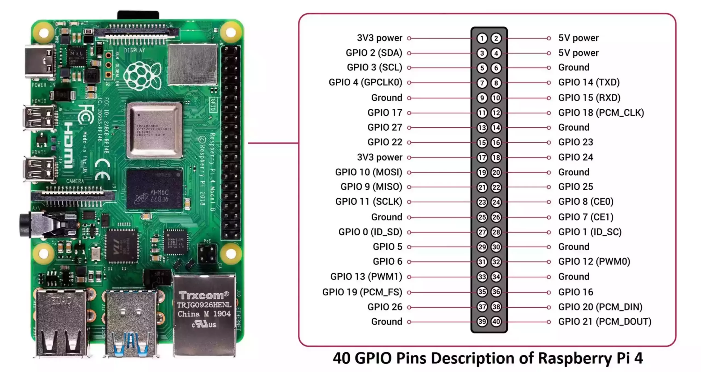

# Rover Diferencial MK2

Rover diferencial autónomo sobre Raspberry Pi 4: dos motores por lado gobernados por una placa L298N (*L298N motor driver board*), IMU por I2C, GPS por UART y cámara, con interfaz web para manejarlo desde el PC o el móvil.

| Carpeta | Qué es |
| --- | --- |
| [`rover/`](rover) | Software del rover real, para la Raspberry Pi. Ver [ARQUITECTURA.md](rover/ARQUITECTURA.md). |
| [`rover_sim/`](rover_sim) | Gemelo digital: el mismo software con un mundo simulado (`mundo.py`) para desarrollar sin hardware. Ver [ARQUITECTURA.md](rover_sim/ARQUITECTURA.md). |
| [`docu/`](docu) | Documentación del hardware (ver abajo). |

En las dos carpetas se arranca igual y la interfaz queda en `http://<ip>:5000/`:

```bash
pip install -r requirements.txt
python main.py
```

## Documentación del hardware

| Fichero | Contenido |
| --- | --- |
| [`docu/Raspberry-Pi-4-Pinout-scaled.webp`](docu/Raspberry-Pi-4-Pinout-scaled.webp) | Pinout de los 40 pines de la Raspberry Pi 4 |
| [`docu/L298N_modulo_Elegoo.pdf`](docu/L298N_modulo_Elegoo.pdf) | Módulo L298N: foto con los bornes rotulados (salidas, alimentación, jumper del regulador de 5 V, ENA/ENB e IN1-IN4), características y ejemplo de control |
| [`docu/L298_hoja_de_datos_ST.pdf`](docu/L298_hoja_de_datos_ST.pdf) | Hoja de datos del chip L298 de ST: diagrama de bloques, patillaje, límites eléctricos y circuitos de aplicación |

Los dos PDF proceden del paquete oficial del kit Elegoo Smart Robot Car V3.0 (`download.elegoo.com`). Elegoo no publica el esquema eléctrico de la placa: lo más cercano es la hoja de datos del chip.

## Pinout de la Raspberry Pi 4



Los pines se nombran por su número **GPIO (BCM)**, que es el que se usa en el código, no por su posición en el conector. Todos trabajan a **3,3 V**: no admiten 5 V en entrada.

### Pines usados por el rover

Definidos al principio de [`rover/hardware.py`](rover/hardware.py); es el único sitio que hay que cambiar si cambia el cableado.

| Función | Constante | GPIO | Pin físico |
| --- | --- | --- | --- |
| L298 ENA (velocidad izquierda, PWM) | `MOTOR_IZQ_ENA` | 12 (PWM0) | 32 |
| L298 IN1 (sentido izquierda) | `MOTOR_IZQ_IN1` | 5 | 29 |
| L298 IN2 (sentido izquierda) | `MOTOR_IZQ_IN2` | 6 | 31 |
| L298 ENB (velocidad derecha, PWM) | `MOTOR_DER_ENB` | 13 (PWM1) | 33 |
| L298 IN3 (sentido derecha) | `MOTOR_DER_IN3` | 19 | 35 |
| L298 IN4 (sentido derecha) | `MOTOR_DER_IN4` | 16 | 36 |
| I2C SDA (IMU) | `I2C_BUS = 1` | 2 | 3 |
| I2C SCL (IMU) | `I2C_BUS = 1` | 3 | 5 |
| UART TX → RX del GPS | `GPS_PUERTO` | 14 | 8 |
| UART RX ← TX del GPS | `GPS_PUERTO` | 15 | 10 |

Los 6 pines del L298 están agrupados entre el pin físico 29 y el 36, en la parte baja del conector. La cámara va por su conector CSI y no ocupa pines del GPIO.

### Pines libres para ampliar

| GPIO | Pin físico | Notas |
| --- | --- | --- |
| 4 | 7 | Libre |
| 17 | 11 | Libre |
| 27 | 13 | Libre |
| 22 | 15 | Libre |
| 25 | 22 | Libre |
| 26 | 37 | Libre |
| 23, 24 | 16, 18 | Libres |
| 20, 21 | 38, 40 | Libres |
| 7, 8, 9, 10, 11 | 26, 24, 21, 19, 23 | SPI0 (CE1, CE0, MISO, MOSI, SCLK). Libres mientras no se active SPI; resérvalos si se añade un ADC para la batería |
| 18 | 12 | Libre como GPIO, pero **no como PWM independiente**: comparte canal con GPIO12 (PWM0), que ya usa el motor izquierdo |

### No usar

| GPIO | Pin físico | Motivo |
| --- | --- | --- |
| 0, 1 | 27, 28 | ID_SD / ID_SC: reservados para la EEPROM de las placas HAT |
| 2, 3 | 3, 5 | Ocupados por el I2C; se pueden compartir con más dispositivos I2C (con otra dirección) |
| 14, 15 | 8, 10 | Ocupados por la UART del GPS |

### Alimentación

| Tipo | Pines físicos |
| --- | --- |
| 3,3 V | 1, 17 |
| 5 V | 2, 4 |
| GND | 6, 9, 14, 20, 25, 30, 34, 39 |

## Conexión de la placa L298N

La placa es la del kit Elegoo Smart Robot Car V3.0: una L298N de **2 canales** (ENA, IN1-IN4, ENB) modificada con **4 conectores de motor**, dos por canal y unidos en paralelo por dentro. Los dos motores de cada lado reciben siempre la misma orden, que es justo lo que necesita un rover diferencial; por eso el software gobierna dos lados y no cuatro motores.

| L298N | Raspberry Pi / otro | Notas |
| --- | --- | --- |
| ENA | GPIO12, pin 32 | Velocidad izquierda (PWM). **Quitar antes el jumper de ENA** |
| IN1 | GPIO5, pin 29 | Sentido izquierda |
| IN2 | GPIO6, pin 31 | Sentido izquierda |
| IN3 | GPIO19, pin 35 | Sentido derecha |
| IN4 | GPIO16, pin 36 | Sentido derecha |
| ENB | GPIO13, pin 33 | Velocidad derecha (PWM). **Quitar antes el jumper de ENB** |
| GND | GND de la Pi (p. ej. pin 30 o 34) **y** negativo de la batería de motores | Masa común obligatoria |
| 12V (VS) | Positivo de la batería de motores | Hasta 12 V con el jumper 5V-EN puesto; hasta 35 V quitándolo |
| 5V | Sin conectar | Ver aviso sobre alimentar la Pi |
| Canal A (2 conectores) | Un motor izquierdo en cada conector | Si un motor gira al revés, se invierte su conector |
| Canal B (2 conectores) | Un motor derecho en cada conector | |

**Avisos importantes:**

- **Jumpers de ENA y ENB.** Si la placa los trae puestos, unen ENA y ENB a 5 V para que los motores giren siempre a tope. Si se conecta un GPIO sin quitarlos, entran 5 V en la Raspberry, que solo admite 3,3 V, y se puede estropear. Compruébalo antes de conectar.
- **No alimentar la Raspberry desde el borne 5V de la placa.** Su regulador da unos 0,5 A y la Raspberry Pi 4 necesita hasta 3 A: se reiniciaría en cuanto arrancasen los motores. La Pi va con su propia fuente o con un regulador aparte.
- **Masa común.** Sin el GND de la Pi unido al de la placa, las señales de control no tienen referencia y los motores hacen cosas raras.
- **Niveles lógicos.** Las entradas de la L298N aceptan los 3,3 V de la Pi (el umbral de nivel alto es 2,3 V), así que no hace falta adaptador de niveles.
- **Caída de tensión.** El L298 pierde unos 2 V: con una batería de 7,4 V, los motores reciben unos 5,4 V.
- **Corriente.** Cada canal da hasta 2 A, repartidos entre los dos motores del lado. Con motores más exigentes, el disipador se calienta y el chip corta.
- **5V de la placa en el kit.** En el kit original, el borne 5V alimenta el Arduino. Con la Raspberry no se usa: queda sin conectar.

Lógica de cada lado (izquierdo con IN1/IN2 y ENA; derecho con IN3/IN4 y ENB):

| IN1 | IN2 | ENA | Resultado |
| --- | --- | --- | --- |
| 1 | 0 | PWM | Avanza, con la velocidad del duty |
| 0 | 1 | PWM | Retrocede |
| 0 | 0 | — | Parado, rueda libre |
| 1 | 1 | 1 | Freno activo |
| — | — | 0 | Parado, rueda libre |
